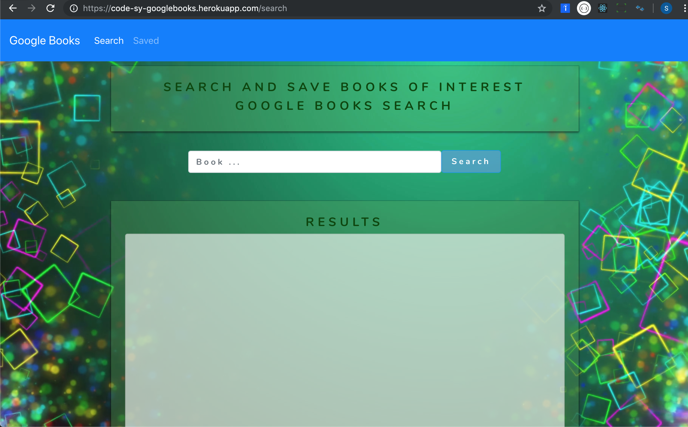
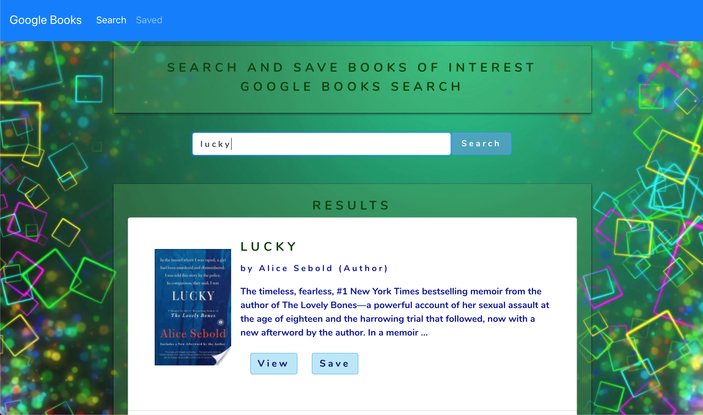
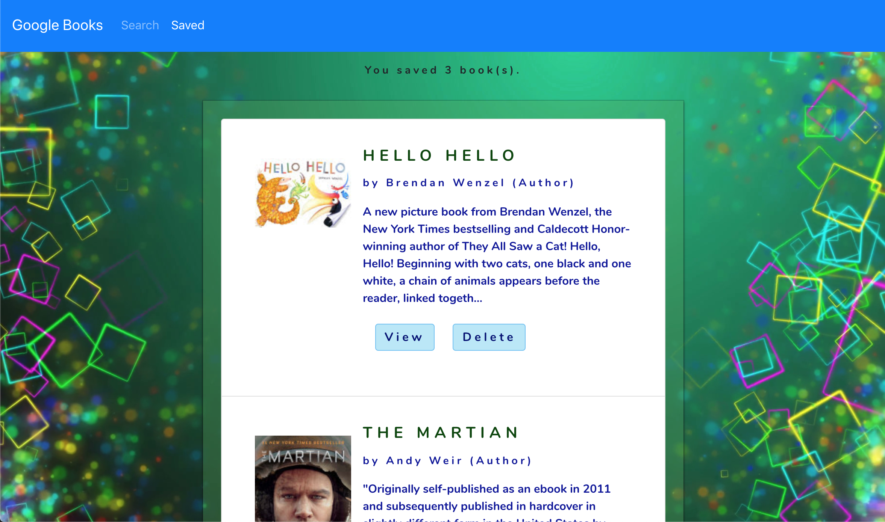

#### Google Books Search.

A React-based Google Books Search application.
- Users can search books via the Google Books API. They have the option to View books on the Google Books page, or Save books.
- Users can also view all of their saved books, with options to View the book at the Google Books site, or to Delete the book if they donot like it anymore.

#### Technologies Used:

Axios, Bootstrap, Create React App, cors, React, Express.js, Heroku, Mongoose, MongoDB, Node.js, React Router, Google Books API, HTML, CSS, JavaScript.

https://code-sy-googlebooks.herokuapp.com/search

